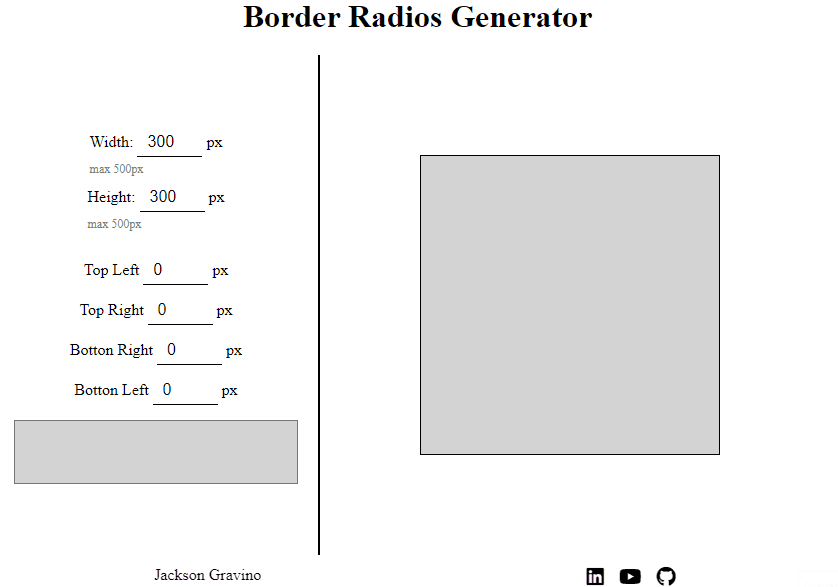

# Border Radios Generator

## Sobre

Esse projeto foi feito com o uma forma de aprimorar minhas abilidades em JavaScript e agilizar a criação de border-radios

## Características

Gerador de border-radios, com exemplo visivel e com o código em css/p>

## Tecnologias usadas

- [HTML]
- [CSS]
- [JavaScript]

### Tela

  

---

Feito por Jackson Gravino
